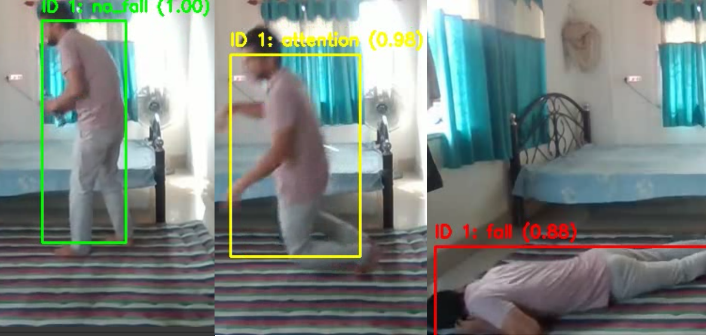
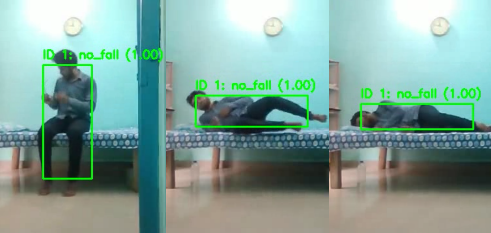

# Project: Fall Detection in Video (YOLO + LSTM) - AI

> Capstone Project for the **MBA in Artificial Intelligence and Big Data ([University of São Paulo - USP/ICMC](https://www.icmc.usp.br/))**
> Projeto do **MBA em Inteligência Artificial e Big Data ([Universidade de São Paulo - USP/ICMC](https://www.icmc.usp.br/))** 
>
> Author / Autor: [Kelson Batista](https://linkedin.com/in/kelsonbatista)\
> Advisor / Orientador: [Ph.D. João E.S. Batista Neto](https://buscatextual.cnpq.br/buscatextual/visualizacv.do?id=K4727975A6&tokenCaptchar=0cAFcWeA6pkywu6NkSLDR5S_JTF6DnaZXnCJnnuiBXoQ0wbmZDz5IZ_Sz-bhG_dNj7G6qXO_DX5S9wP15ldCoHm_Qj-LffaIJjLb3hJXqjiWpCaG3xY1JMRPb815DBasK-lQ9vHitxry2SFcJjHXnZhJ01dyRazgc6ZjVXqqH-W_aO6LBsJIaHoRPnEs76eETMR8tXa05wrWqb4qeM0pkREzxG2CmPUPZLfPRn0l0HEAtp96U9FDpSIzQLdr0C3SW-AA8wHqpFgnNnxhXPTuJjhstD99Sp08WMhvzDJC9ttZnRz_f-7OA5fIX5xdoI8k452BT141qVFPm15iLefuHVuKzwqEr3O296N94FR2JqV7EXBEkTt4SmqlXfGkcPW6Raq4Up9xebL0LbURD5KcD2rXDnEsh0Yyxws2xdJFyNu4o_lBi3hif2QQleRTzYGpv4NF8XDJkeTy-ycTazCcb06pOeJMXszhdMRNJWBe18ZSYrmkJnHRmc7kfnBEUzsdB58R2DbejWisvxaPp__8ojMVuOK710qLKtZnlOucdEwGYdLnwtccbOfZcKH03PVgyOAQDf5LXInuOp6cVOa55AgSx1lKtUcYG2HDJ8-WpT5ikaNwKcOlXOqIEAzwO8lvBLRLj-6W9vY4BA0kum4YTeoEOi3utzGtBb8MInLUKXz7gKU4SwmgMlbKCHzirsIV3ot3XMomg_TJL-qIfafuQAmqZUcTOXIeKXS9lLW3kHcbrL7HJeHoKmj8OeAnY8dG1cGClKkwtLEzSEYzvhiYQG432MQP0ko54X8AnzVbDGTyGTW9slNB15ALsrR9QnoJM8pd3BHwidEhYKY84i5enE5WwKzxqDgF7XoA)

**Keywords:** Fall Detection, Human Activity Recognition, Pattern Recognition, Temporal Classification, Convolutional Neural Networks, Domestic Accidents

**Palavras-chave:** Detecção de quedas, Reconhecimento de Atividade Humana, Classificação Temporal, Reconhecimento de padrões, Redes Neurais Convolucionais, Acidentes Domésticos 

<br>

## ℹ️ About the Project / Sobre o Projeto

In recent years, the number of people living alone has increased significantly, making them more vulnerable to emergency situations such as falls caused by fainting, tripping, or illness. In many cases, the individual may be unable to get up or call for help, and may even lose consciousness. Delays in assistance can lead to serious complications, permanent injuries, or even death. Systems based on wearable or environmental sensors have proven to be inefficient, invasive, and unreliable. In this context, this project aims to explore the use of artificial intelligence through computer vision to detect falls in videos and in real time in home environments, contributing to the safety and quality of life of millions of people who live or find themselves alone.

---

Nos últimos anos, o número de pessoas que moram sozinhas tem crescido de forma expressiva e estão sujeitas a situações de emergências nos casos de quedas, seja por desmaios, tropeços ou enfermidades. Em muitos casos, a pessoa fica impossibilitada de se levantar ou pedir ajuda, podendo até perder a consciência, e a demora no socorro pode levar a complicações graves, sequelas permanentes ou até mesmo ao óbito. Sistemas com sensores vestíveis ou ambientais se mostram ineficientes, invasivos e não confiáveis. Diante disso, esse projeto tem o objetivo explorar o uso da inteligência artificial através da visão computacional para detectar quedas em tempo real nos ambientes domésticos, contribuindo para a segurança e a qualidade de vida de milhões de pessoas que vivem ou se encontram sozinhas.

<br>

## 🔍 Overview / Visão Geral

The system was implemented with a two-stage pipeline:

- The first stage consisted of training with **YOLOv11-pose, a Convolutional Neural Network** for detection and pose estimation, and extracting features from each frame as 128-dimensional vectors containing static (position) and dynamic (velocity) data.

- The second stage involved using these vectors, arranged in 30-frame sequences (windows), to train a **temporal classification model using a Recurrent Neural Network, LSTM**, capable of analyzing and classifying the action contained within that time window.

---

O sistema foi implementado com um pipeline em duas etapas principais:

- A primeira etapa consistiu no treinamento com o **YOLOv11-pose, uma Rede Neural Convolucional** para detecção e estimativa de pose, e extração de características de cada frame, vetores de 128 dimensões contendo dados estáticos (posição) e dinâmicos (velocidade).

- A segunda etapa envolveu a utilização dos vetores em formato de sequências (janelas) de 30 frames para treinar um **modelo de classificação temporal em uma Rede Neural Recorrente, LSTM**, capaz de analisar e classificar a ação contida nessa janela de tempo.

<br>

## 📂 Dataset / Base de Dados

Paper: [GMDCSA-24: A dataset for human fall detection in videos](https://www.sciencedirect.com/science/article/pii/S2352340924008552)

Github: [GMDCSA-24: A dataset for human fall detection in videos](https://github.com/ekramalam/GMDCSA24-A-Dataset-for-Human-Fall-Detection-in-Videos)

Author: Ekram Alam. (2024). ekramalam/GMDCSA24-A-Dataset-for-Human-Fall-Detection-in-Videos: 2.0 (v2.0) [Data set]. Zenodo. https://doi.org/10.5281/zenodo.12921216

<br>

## 🧩 Technologies / Tecnologias

- Python 3.10+

- AWS SageMaker **ml.g4dn.xlarge** (Jupyter Lab Notebook for training/treinamento)

- CVAT Computer Vision Annotation (for labeling/anotações)

- Docker (for running CVAT/rodar CVAT)

Main dependencies / Dependências principais:

- Ultralytics (YOLOv11 for detection/detecção)

- OpenCV

- Numpy, pandas

- Albumentations

- Scikit-learn

- TensorFlow/Keras (LSTM for temporal classification/classificação temporal)

- Matplotlib


<br>

## ✨ Pipeline archtecture / Arquitetura do pipeline

1. **Dataset preparation and organization / Preparação e organização da base de dados**

    - 01-flatten-rename-videos.py
    - 02-unzip-organize-after-cvat.py
    - 03-resize-images.py
    - 04-folders-integrity-box-pose.py
    - 05-labels-integrity.py
    - 06-update-classes-box-pose.py
    - 07-class-redistribution-move.py
    - 08-count-classes-weights.py
    - 09-aug-apply-images.py

2. **YOLOv11 training / treinamento**:

    - 10-yolo-training.ipynb
    - 11-yolo-validation-test.ipynb
    - 12-yolo-predict.ipynb

3. **Features extraction in windows / Extração de características em janelas**

    - 13-aug-apply-videos.py
    - 14-lstm-training-windows.ipynb

4. **LSTM training / treinamento**

    - 15-lstm-training.ipynb

5. **Model evaluation / Avaliação do modelo**

    - 16-lstm-evaluation.ipynb
    - 17-model-video-testing.ipynb

<br>

## 📊 Results / Resultados

**YOLOv11n-pose:**

- Global accuracy / Acurácia global ~ 81%

    - Class fall: 92%

    - Class no_fall: 93%

    - Class attention: 46%

**LSTM:**

- Global validation accuracy / Acurácia global de validação: 96.6%

- AUC (fall vs no fall / queda vs. não-queda): 0.9993

- Low rates of false positives and negatives / Baixas taxas de falsos positivos e negativos.

<br>

More metrics in the project paper / Mais métricas no TCC.

<br>

## 📈 Qualitative tests / Testes qualitativos:

**Case Study 1:** The correct identification of classes during movement, particularly for the transitional `attention` action, demonstrates that the model has learned the characteristic temporal patterns of an unintentional fall, confirming its effectiveness in this analysis.

**Estudo de Caso 1:** A identificação correta das classes durante os movimentos, principalmente na ação transitória `attention`, demonstra que o modelo aprendeu os padrões temporais característicos de uma queda não intencional, confirmando sua eficácia nessa análise.



**Case Study 2:** Despite the transition from a vertical to a horizontal position, the model correctly classified the entire sequence of movements as `no_fall`. The temporal analysis distinguished the speed and controlled manner of lying down from the abrupt and uncontrolled acceleration that is characteristic of a real fall.

**Estudo de Caso 2:** Apesar da transição de uma posição vertical para horizontal, o modelo classificou corretamente toda a sequência de movimentos como `no_fall`. A análise temporal diferenciou a velocidade e a maneira de deitar-se de uma aceleração abrupta e descontrolada característica de uma queda real.



<br>

## 📝 Limitations and next steps / Limitações e próximos passos

**Generalization:** Validate on broader datasets and in less controlled environments.

**Architectures:** Explore GRU, BiLSTM, and Transformers for video analysis.

**Product:** Integrate an automatic alert system and optimize for edge devices (deployment on low-cost hardware).

**Scenarios:** Expand detection to include fainting/prolonged immobility, multiple people, occlusions, and challenging lighting conditions.

---

**Generalização:** Validar com bases mais amplas e ambientes menos controlados.

**Arquiteturas:** Explorar GRU, BiLSTM, Transformers para vídeo.

**Produto:** Integrar alertas automáticos e otimizar para edge devices (embarcar em hardware de baixo custo).

**Cenários:** Expandir para detectar desmaios/longa imobilidade, múltiplas pessoas, oclusões, iluminação difícil.

<br>

## 🤝 Acknowledgments / Agradecimentos

- To my family and fellow students.

- To ICMC/USP, professors, and for the guidance of my advisor, Ph.D. João E.S. Batista Neto.

- To the open-source software community: Python, CVAT, Docker, Ultralytics YOLO, TensorFlow/Keras, OpenCV, and Albumentations.

---

- À minha família e colegas de curso.

- Ao ICMC/USP, docentes e orientação do Dr. João E.S. Batista Neto.

- À comunidade de software livre: Python, CVAT, Docker, Ultralytics YOLO, TensorFlow/Keras, OpenCV, Albumentations).


<br>

## 📜 License / Licença

**GPL-3.0 license (GNU General Public License v3.0):** This open-source license is perfect for students, researchers, and enthusiasts. It encourages open collaboration and knowledge sharing. See the [LICENSE](https://github.com/kelsonbatista/fall-detection-ai-project?tab=GPL-3.0-1-ov-file) file for full details.

**Licença GPL-3.0 (GNU General Public License v3.0):** Essa licença de código aberto é ideal para estudantes, pesquisadores e entusiastas. Ela incentiva a colaboração e o compartilhamento de conhecimento. Para mais detalhes, consulte o arquivo completo da [LICENÇA](https://github.com/kelsonbatista/fall-detection-ai-project?tab=GPL-3.0-1-ov-file) no repositório.

<br>

## ✍🏻 Cite

If you find this project helpful, **give me a star** ⭐ / Se você achar esse projeto útil, **me dê uma estrela** ⭐

Article (Bibtex):

```
@article{Kelson_Fall_Detection_2025,
  title={Aplicação de Visão Computacional para Detecção de Quedas em Ambientes Domésticos Utilizando Redes Neurais YOLO e LSTM},
  author={Batista, K.S.},
  journal={MBA em Inteligência Artificial e Big Data. Universidade de São Paulo USP-ICMC},
  year={2025},
  month = {out.},
  url={}
}
```

Code (Bibtex):

```
@software{Kelson_Fall_Detection_Code_2025,
    author = {Kelson Batista},
    license = {GPL-3.0},
    month = ago,
    title = {{Fall Detection Model with Ultralytics YOLO version 11 and LSTM}},
    url = {https://github.com/kelsonbatista/fall-detection-ai-project},
    version = {1.0.0},
    year = {2025}
}
```
<br>

## 📞 Contact / Contato

For questions, discussions, and support, contact me at **kelsonbatista [at] gmail.com**.

Para dúvidas, discussões e suporte, entre em contato comigo em **kelsonbatista [at] gmail.com**.

